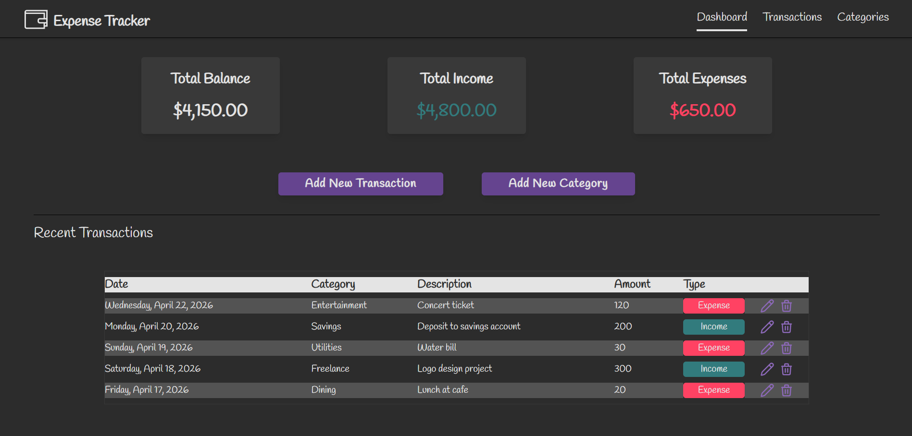
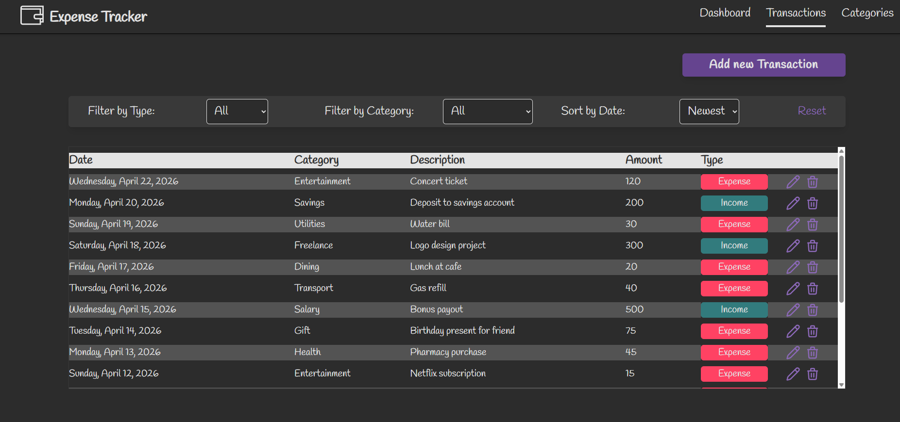
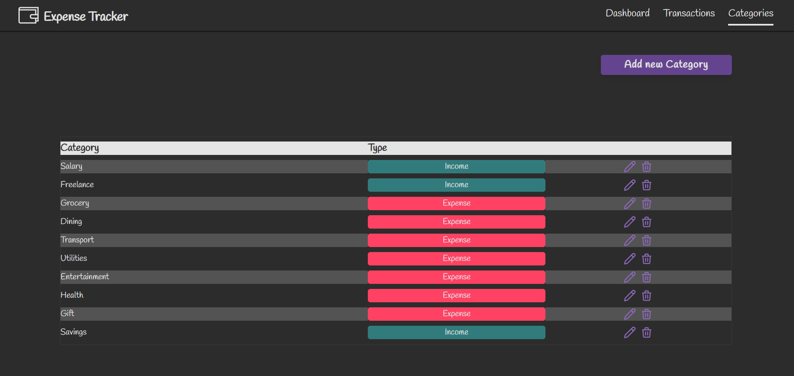
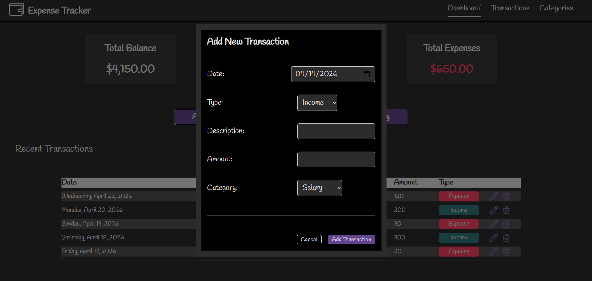
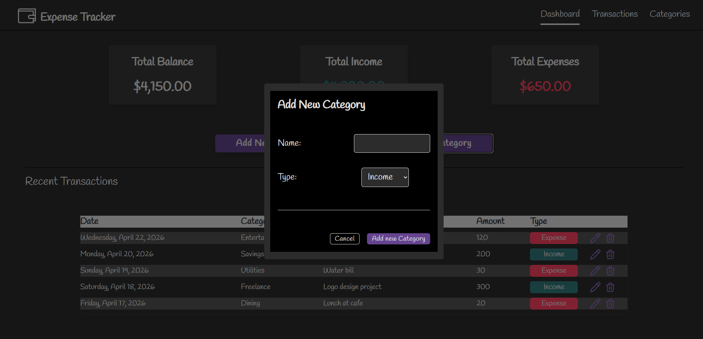

## Expense Tracker

This is the fourteenth day of my 50 day react projects journey. This is a simple Expense Tracker App that has a functions of CRUD (Create, Read, Update, Delete).

I use context API, useReducer, custom hooks, local Storage, tailwind and Typescript here.

